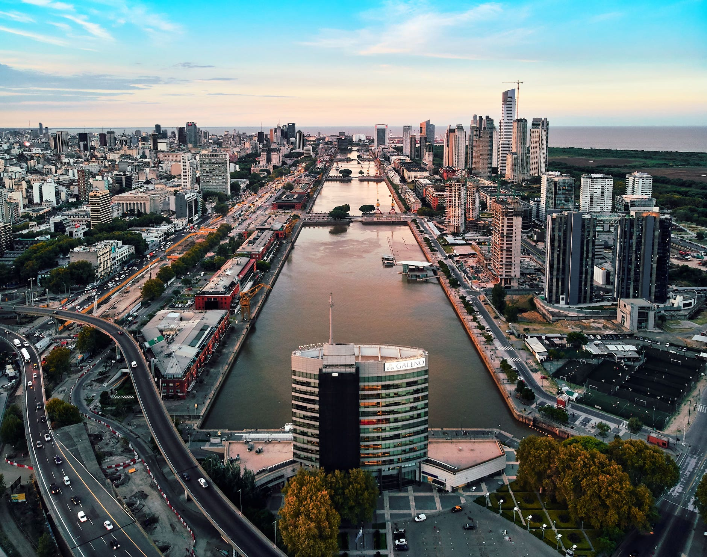
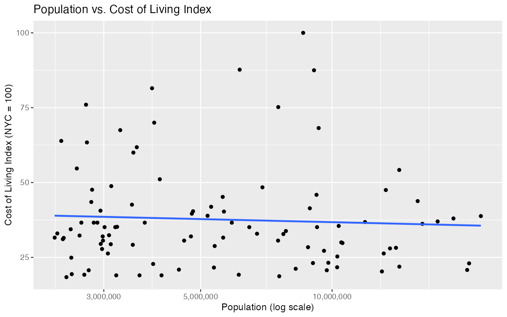
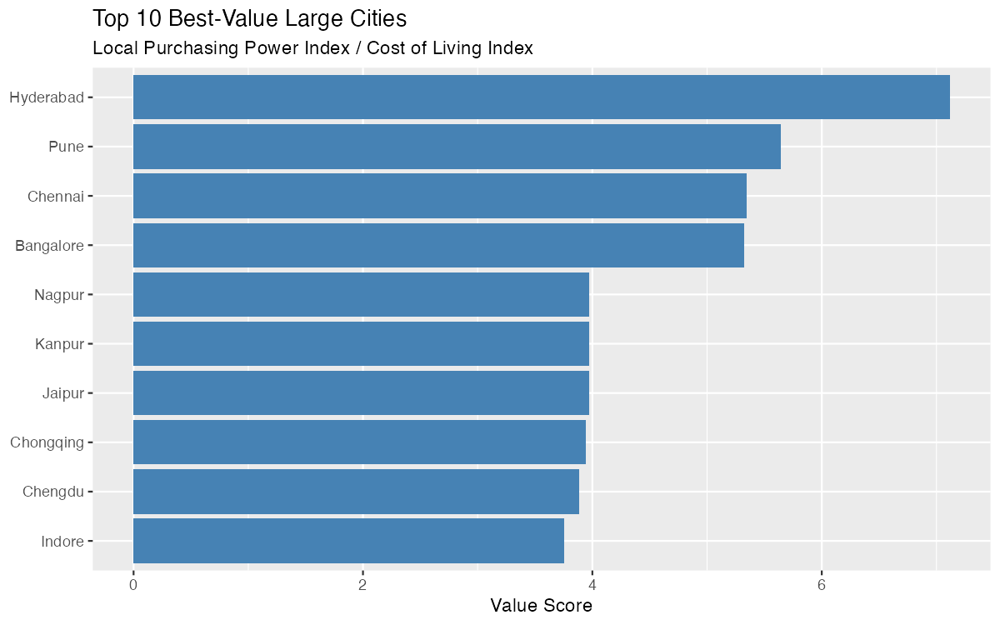
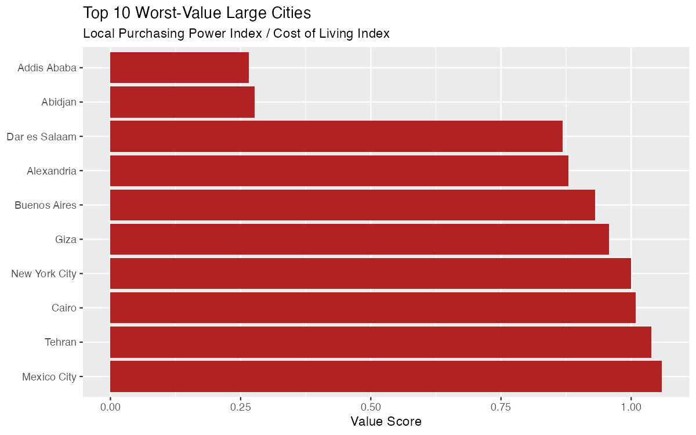

{width="900px"}

Big cities are assumed to cost more to live in. Tokyo, Shanghai and Delhi, surely all that scale drives prices up? I decided to test that assumption directly, and the answer turned out to be more interesting than a simple yes or no.

To do this, I pulled population data for the world's largest cities from Wikipedia, then matched each one against Numbeo's crowdsourced cost-of-living rankings. Numbeo's database scores cities on prices for groceries, rent, restaurants, and more, all benchmarked against New York City (set at 100). Not every huge city has enough Numbeo data to be scored, so I widened my search until I found 100 large cities with reliable data, reaching as far as the 174th-largest city in the world to fill that quota, out of 479 cities Numbeo tracks overall. Considering this, it is important to note that my sample skews toward cities that are well-documented online, which tends to mean wealthier and more internationally connected cities. A lot of very large but less-tracked cities (particularly across parts of Africa and South Asia) simply didn't have enough data for me to include.

For each city, I calculated a "value score" or local purchasing power divided by cost of living. This can be thought of as how far does a typical local salary actually stretch against local prices. A score above 1 means wages outpace costs and below 1 means the opposite.

**Population size told me almost nothing about cost of living**

When I ran the numbers, I found essentially no relationship between how big a city is and how expensive it is (see Figure 1). This correlation came out to -0.09, which is about as close to "no pattern" as real-world data gets. Some of the cheapest cities I measured (several mid-sized Indian cities) sit right alongside some of the world's largest metros in population, while a few smaller cities on my list were nearly as pricey as New York. The old assumption that scale drives up cost simply doesn't hold once I looked past a handful of famous outliers like Tokyo or Shanghai.

{#fig-1 width="700px" fig-align="center"}

**India's mid-size tech hubs offer exceptional value**

The top of my best-value list was dominated by Indian cities: Hyderabad topped the list with a value score of 7.1, followed by Pune, Chennai, and Bangalore all above 5 (see Figure 2). That means a typical local salary in Hyderabad buys roughly seven times more relative to living costs than the same ratio in a low-value city like Addis Ababa. Two Chinese cities, Chongqing and Chengdu, are also in my top 10. The takeaway here is that, for remote workers with location flexibility, employers setting cost-of-living-adjusted salaries, or companies scouting new office locations, these cities represent a genuinely underrated combination of large talent pools and strong purchasing power. This does not mean that they are just "cheap," but cheap relative to what people there actually earn.

{#fig-2 width="700px" fig-align="center"}

**"Worst value" hid two very different stories**

My bottom 10 split into two distinct groups, and the difference matters a lot in practice. Mexico City, Tehran, Cairo, Buenos Aires, and New York City itself all scored close to 1.0, meaning costs and local purchasing power are roughly balanced there (see Figure 3). That's not necessarily bad, it is just average.

The real outliers I found were Abidjan and Addis Ababa, scoring 0.28 and 0.27, considerably lower than everywhere else on the list. Here's the nuance I want to highlight: these cities aren't expensive by sticker price (their cost-of-living index is actually moderate). What drags their score down is very low local purchasing power. Wages are simply too low relative to even modest costs. This is a distinct problem from high prices, and it might call for a different response. Anyone setting compensation for expat staff, aid workers, or business travelers in these cities should recognize that "moderate local prices" doesn't mean affordability for the people who actually live there because local salaries aren't providing the cushion that similar price levels would provide elsewhere.

{#fig-3 width="700px" fig-align="center"}

**The bigger picture**

This analysis seems to suggest that it may be inaccurate to treat "big city" and "expensive city" as synonyms. They're not the same axis at all. I'd argue that a better way to evaluate where money goes further (whether that is the result of relocation, international hiring, or just curiosity) is to look at purchasing power relative to cost, not cost in isolation. By that measure, some of the most attractive cities I found for stretching a dollar rarely make anyone's "expensive city" headlines.

Full code, data, and README are available on GitHub: [cost-of-living-scraper](https://github.com/emiliomb-png/Cost-of-Living-Scraper)
