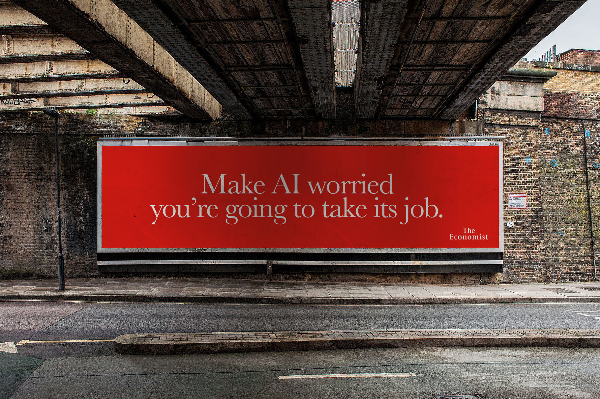
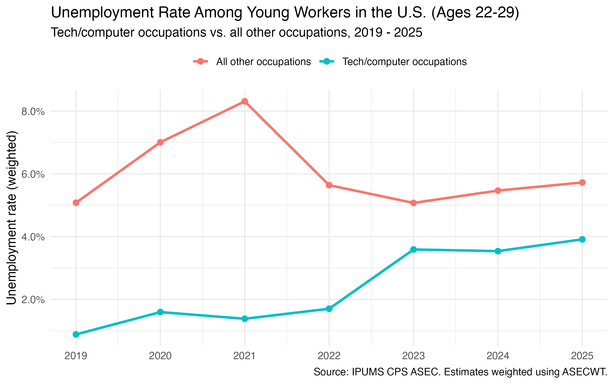
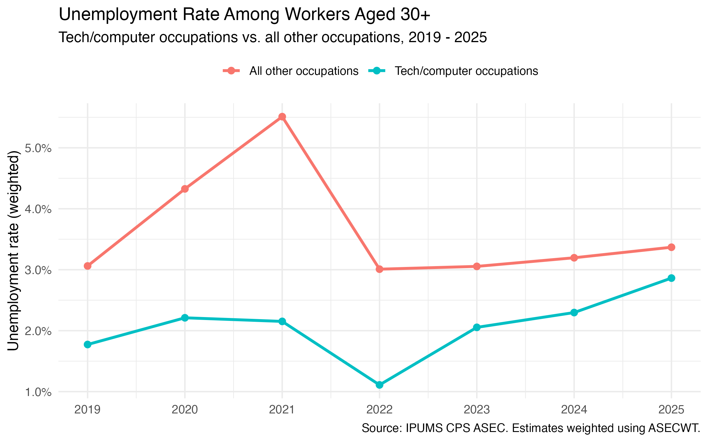
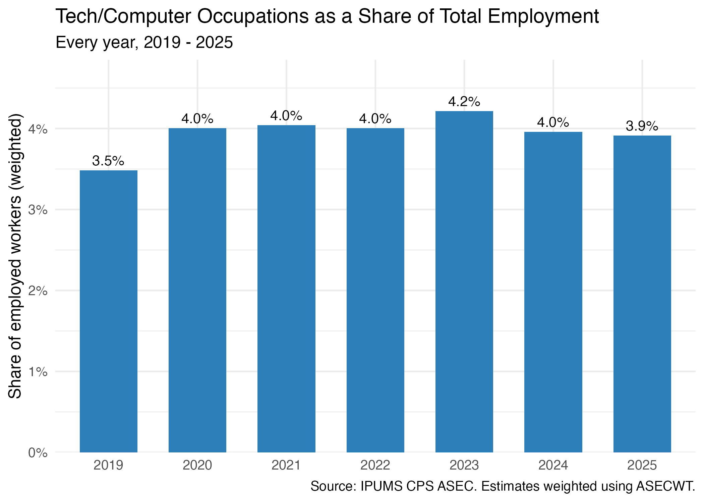
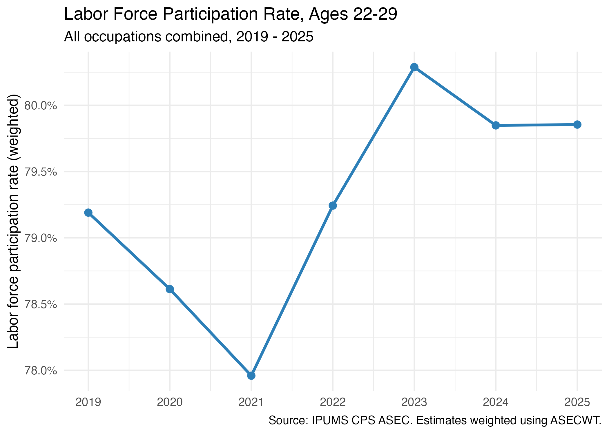

{width="900px"}

Worrying about AI replacing humans in the labor market may be one of the most common concerns among workers since the launch of ChatGPT in late November 2022. I wanted to see if there is any sign that generative AI has actually affected the labor market. Using IPUMS CPS data from 2019 to 2025 (three years prior and three years after the launch of ChatGPT), I focused my analysis on comparing employment outcomes for "computer occupations" (software developers, programmers, systems analysts, and similar roles) with overall employment outcomes (all occupations), using four visuals built from weighted CPS estimates.

The first insight is that among workers aged 22–29, tech unemployment sat low and stable through 2021, around 1.4–1.6%. Then, starting in 2022, it began climbing every single year, reaching roughly 4% by 2025 (see Figure 1).

{#fig-1 width="700px" fig-align="center"}

That alone wouldn't mean much, except that overall unemployment rate was moving in the opposite direction over the same period, spiking during the pandemic recovery, then falling steadily as the broader job market improved. The two lines essentially swap places right around 2022. I found the same crossover among workers 30 and older: tech unemployment bottoms out in 2022, then rises every year after, while overall unemployment stays flat (see Figure 2). This is a first indication that tells us that some specific factor is pulling on the tech occupations, a factor that is not necessarily having any incidence in the overall unemployment rate.

{#fig-1 width="700px" fig-align="center"}

But the explanation does not seem to be that AI is making some jobs disappear. If AI were simply replacing tech workers, I'd expect to see computer occupations shrinking as a share of total employment. They aren't (see Figure 3). Tech's share of the workforce has held steady hovering between 3.5% and 4.2% the entire period, with only a slight dip in 2025. So whatever is happening, it isn't tech jobs disappearing outright. It looks more like people already working in tech are having a harder time staying employed, or a harder time landing back on their feet once they lose a job.

{#fig-1 width="700px" fig-align="center"}

At this point it seems important ruling out the obvious alternative explanation. For this, I checked whether young people are just giving up on work in general. If overall youth labor force participation were falling, the tech-unemployment rise might just be one symptom of a broader retreat of young people from the job market, which would indicate that there is no specific factor affecting tech jobs at all. However, according to the data, participation among 22–29 year-olds actually rose to a peak in 2023 and has held steady since (see Figure 4). Young workers are still out there, still looking for jobs. They're just not landing tech jobs as easily as they used to.

{#fig-1 width="700px" fig-align="center"}

So does this mean AI is the cause of the decline in employment in tech jobs? The timing lines up suggestively: the tech unemployment climb starts right as generative AI tools were taking off, but 2022 and 2023 were also messy years for entirely different reasons. The Federal Reserve raised interest rates aggressively starting in 2022 to fight inflation. Venture funding tightened, and a lot of tech firms pulled back hiring or cut staff as a result. On top of that, major tech companies including Meta, Amazon and Google that had overhired during the pandemic, ran large layoffs in 2022 and 2023. This situation was not particularly related to AI but rather was an effect of pandemic-era over-expansion.

Both of the previously described forces would produce a very similar pattern to the one I'm seeing from the data: rising tech unemployment, stable tech employment share. In order to untangle the different factors at play here would need more granular data, for example, task-level measures of how exposed specific jobs are to AI tools, for instance, rather than a broad occupation category.

**The takeaway**

The pattern of increased unemployment in tech jobs is consistent with generative AI's market launch, but it's important to highlight that this is a correlation with AI's arrival, not proof of it. Rate hikes and layoff corrections are at least as plausible an explanation. The most likely explanation is that all three forces are tangled together. Separating them will require a more in-depth analysis.

Full code, data, and README are available on GitHub: [AI and Jobs](https://github.com/emiliomb-png/AI-and-Jobs)
