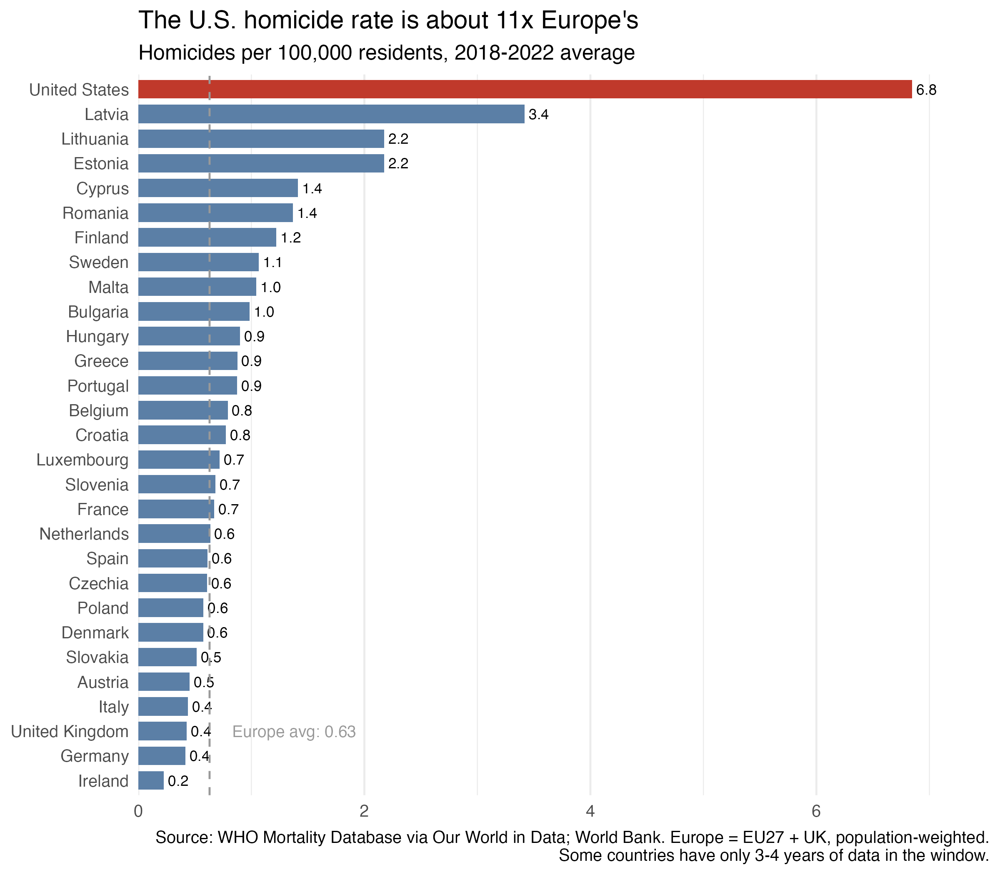
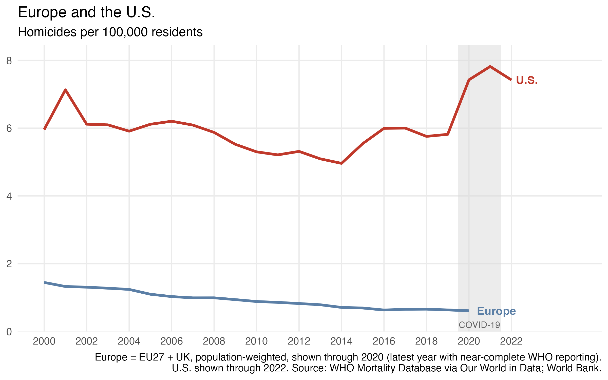
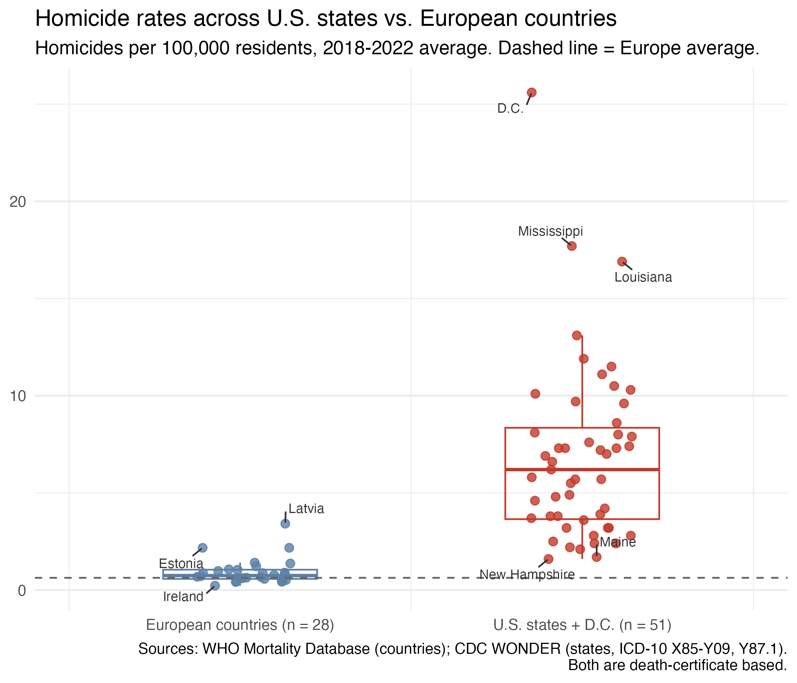
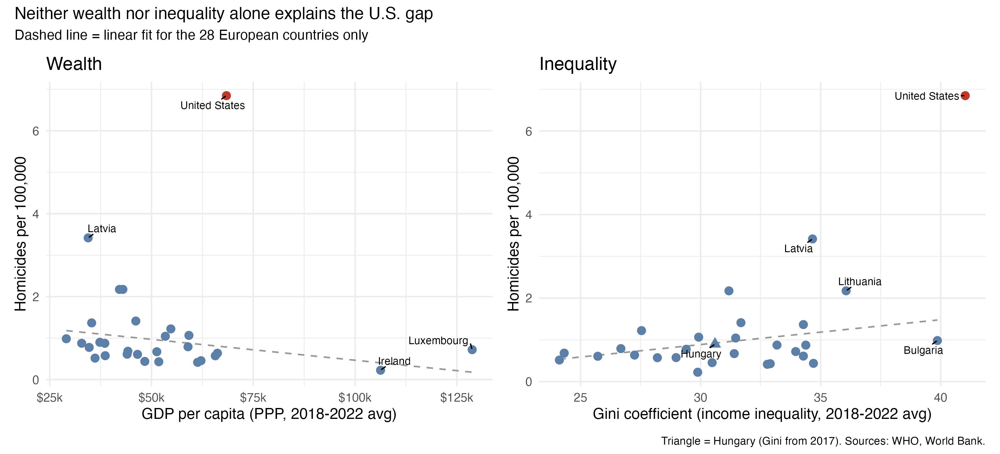

{width="900px"}

Recent debates have brought to light the question of whether Europe is becoming less safe and whether the U.S. is actually safer in comparison. I set out to look for the data to try to have a better grasp of this debate. The first thing that I should note is that comparing crime across countries can be challenging because police record offenses differently. So I used the measure that travels best: homicide, counted from death certificates. The data I used covers the U.S. and 28 European countries (the European Union or EU plus the UK), averaged over 2018-2022. Country data comes from the World Health Organization (WHO) and state data from the Centers for Disease Control and Prevention (CDC).

The headline is hard to miss. The U.S. homicide rate is about 6.8 homicides per 100,000 people a year. The population-weighted European average is 0.63, so the U.S. rate is roughly eleven times higher. Even Latvia, Europe's highest at 3.4, is about half the U.S. figure. Lithuania and Estonia sit at 2.2, while Ireland (0.2), Germany, and the UK (both 0.4) are at the bottom (see Figure 1).

{#fig-1 width="700px" fig-align="center"}

The gap between Europe and the U.S. didn't open recently. In 2000, the U.S. rate was about four times Europe's. By 2019 it was about nine times. Europe's rate fell by more than half, from about 1.45 to 0.61, while the U.S. stayed between roughly 5 and 7 and then jumped to almost 8 in 2021 (see Figure 2). It is worth noting that I stop the European line at 2020 on purpose. After that year, WHO data is missing for large countries such as Germany. The weighted average would then move because of who is reporting, not because anything changed. 

{#fig-1 width="700px" fig-align="center"}

At first, you could think that the U.S. national number hides a few extremely violent states pulling up an otherwise more European-looking country. However, the data seem to suggest a different story (see Figure 3). The median U.S. state has a rate of about 6.2, roughly eight times Europe's median country (0.75). All 51 jurisdictions (50 states plus D.C.) are above that European median, and 39 of them are above every European country. The spread is still huge. Mississippi (17.7) and Louisiana (around 17) are in a league of their own, and D.C. tops 25. At the other end, New Hampshire and Maine, at about 1.7, would still rank behind only the three Baltic states if they were European countries. This indicates that the national figure from the U.S. is not the consequence of a few outlier states with high homicide rates. Overall, the picture seems to suggest that the high homicide incidence in the U.S. is not a state-specific circumstance but rather a nationwide trend.

{#fig-1 width="700px" fig-align="center"}

After seeing this trend, I wanted to understand why this could be happening and what other factors could be explaining this phenomenon. Of course, there are several plausible explanations for this. For the sake of brevity, I explore two usual suspects:   wealth and inequality (see Figure 4). Within Europe, the relationships are weak. Richer countries have slightly lower homicide rates, and more unequal ones slightly higher rates. The U.S. is far above both. If I extend the European lines to the U.S. level of income and inequality, they predict rates of about 0.8 and 1.5. The actual figure is 6.85.

The inequality panel is interesting. With the U.S. in the top right corner, it looks like a strong upward relationship, and across all 29 countries the correlation is about 0.5. But one point is doing nearly all the work. Remove it, and the correlation among the 28 European countries is about 0.3. In this case, the single extreme observation of the U.S. can manufacture a trend. Based on this data, it seems that neither wealth nor inequality alone explains the U.S. gap.

{#fig-1 width="700px" fig-align="center"}

It is important to remind ourselves here what that this is a descriptive rather than a causal analysis, therefore I was able show where and how large the gap is, but not why. Also, it is worth noting again that I measured just one variable associated with crime: homicide. There are additional variables associated with non-lethal violence that might be considered to have a more accurate picture of whether overall crime is in fact higher in the U.S. than in Europe. 

**The takeaway**

In terms of homicide, the analysis seems to suggest that the U.S. isn't Europe with a few bad states. Its typical state looks very different from Europe's typical country, and the gap has widened over two decades. The obvious economic explanations, wealth and inequality, seem to leave most of the gap unexplained. This raises interesting questions about the causes of this large gap. An analysis that explores this will require a more in-depth exploration of additional factors.

Full code, data, and README are available on GitHub: [Crime Comparison](https://github.com/emiliomb-png/Crime-Comparison)
